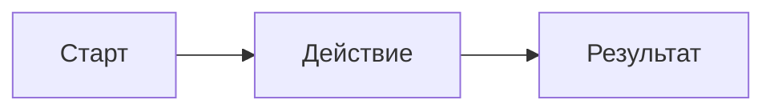

<!-- СГЕНЕРИРОВАНО bin/mirror.js. Не редактировать: правки затрёт следующая генерация.
     Источник правды — domains/<домен>/. -->

# Mermaid-схемы

## Обязательная init-строка

Каждая mermaid-схема в заметках должна начинаться со строки настройки `useMaxWidth: true` — это включает адаптивную ширину рендера в Obsidian (схема растягивается по ширине заметки и не обрезается).

Первая строка внутри блока `mermaid` всегда:

```
%%{init: {"flowchart": {"useMaxWidth": true}}}%%
```

### Пример

````markdown

````

## Правила

- Init-строка идёт **первой** строкой внутри блока, до объявления типа диаграммы (`flowchart`, `sequenceDiagram` и т.п.)
- Не оборачивай init в комментарии — это специальный синтаксис mermaid, а не комментарий
- Применяется ко всем типам диаграмм, где есть `flowchart`-конфиг (для `sequenceDiagram` и других подбирай соответствующий ключ конфига при необходимости — основной кейс это `flowchart`)
- При рефакторинге/правке существующих mermaid-блоков без init-строки — добавляй её

## Где применяется

Все скиллы и рабочие процессы, которые создают или редактируют mermaid-схемы в заметках:

- `obsidian-ingest` — при визуализации концептов
- `obsidian-note-canvas-map` — если генерится mermaid вместо canvas
- `obsidian-split-note`, `obsidian-refactor-lecture` — при сохранении/переносе схем
- Ручные правки заметок через ассистента
